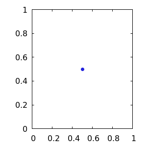

# quasi-rd

[](https://docs.rs/quasi-rd)
[](https://crates.io/crates/quasi-rd)

An implementation of the quasirandom _Rd_ sequence described in [this blog post][1]. This sequence may not necessarily be optimal for all dimensionalities or all applications but it has the advantage of working quite well in general, being very fast to generate and also being parameter-free as all the parameters are fixed and thus do not require application-specific configuration.

This implementation _does not_ use floating-point arithmetic to compute the sequence but uses a 128-bit fixed-point representation, only converting to floating-point as a final step if required. As a result it produces exact sequences of up to 2^64 samples, which should be enough for almost every application. Parameters for up to 1M-dimensional sequences are computed to within 128 bits of accuracy using rational arithmetic.

## Usage

This code generates quasirandomly distributed points in two dimensions:

```rust
use quasi_rd::Sequence;

let mut sequence = Sequence::new(2);

for _ in 0..500 {
    println!("({}, {})", sequence.next_f64(), sequence.next_f64());
}
```

Plotting these points will produce a distribution like this:

<p align="center">
    
</p>

# License

This crate is licensed under the terms of the MIT license. See `LICENSE.md` for more information.

[1]: http://extremelearning.com.au/unreasonable-effectiveness-of-quasirandom-sequences/
